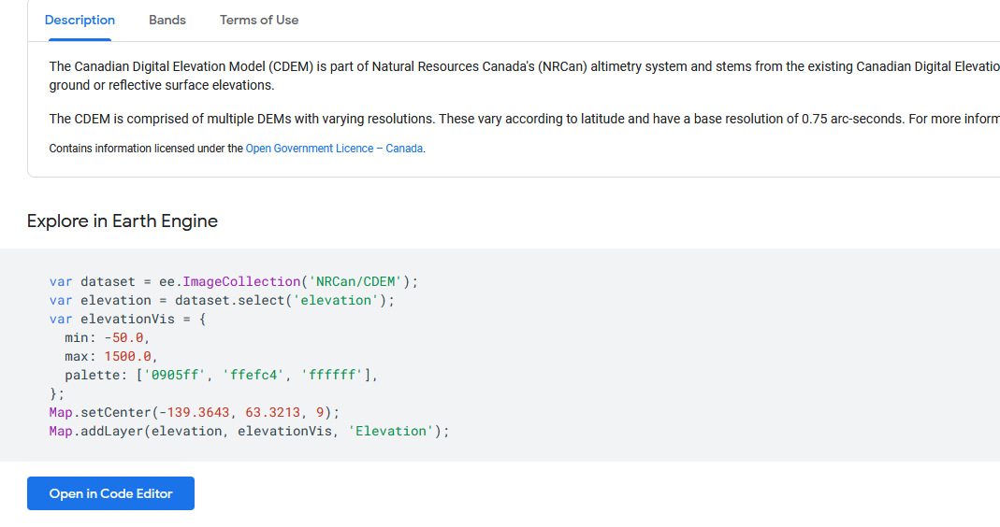
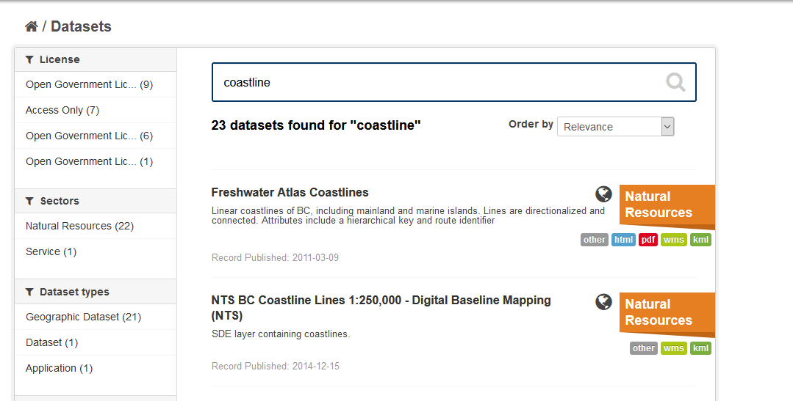

# Acquire Data

## Data from the City

Port Alberni has provided you with three data files that will be needed for the analysis:

1) CityBoundaries.shp - Delineates the city boundaries

2) Properties.shp - The boundaries and ZoneCode of all properties in Port Alberni

3) Sirens.shp - The coordinates of the tsunami warning sirens

4) Shelters.csv - Text file with the Lat/Lon coordinates of the tsunami warning shelters.


The city hasn’t given you all the data you need to address the questions they’ve asked.  We need to retreive some more layers to complete the project.

## Downloading Census Data

We need to download Dissemination Area level population data for the Port Alberni [census agglomeration](https://www150.statcan.gc.ca/n1/pub/92-195-x/2011001/geo/cma-rmr/cma-rmr-eng.htm) area using Simply Analytics.  You have access to this platform through the [UBC library](https://www.library.ubc.ca/).  Follow the link, and sign in/create an account.

<div style="overflow: hidden;
  padding-top: 56.25%;
  position: relative">
  <iframe src="SA_Access.mp4" title="Processes" scrolling="no" frameborder="0"
    style="border: 0;
   height: 100%;
   left: 0;
   position: absolute;
   top: 0;
   width: 100%;">
   <p>Your browser does not support iframes.</p>
 </iframe>
</div>
<a href="SA_Access.mp4" target="_blank">View Image in New Tab</a>

## Question 0)
What is the difference between a Census metropolitan and a census agglomeration area?

## Download a DEM from Google Earth Engine

We're going to download the [Canadian Digital Elevation Model](https://developers.google.com/earth-engine/datasets/catalog/NRCan_CDEM#description) (CDEM) from Google Earth Engine.  

**1)** Open the GEE Code editor and explore the CDEM.
* Use the link above to access the docs page for CDEM.  Midway down the page you will see some sample code and an option to Open the code Editor.
	* Open the sample code they provide.
	* Run it and see what happens.


* Change the coordinates of the Map.setCenter command to (-124, 49, 10).
	* -124, 49 are longitude and latitude, 10 is the "zoom level" for the display.

**2)** Download the DEM for the area around Port Alberni.
* In addition to uploading boundary files, you can define geometries (eg. a Rectangle) to download the data for a specific area.
* Copy and paste the code below at the end of the code.
	* Run it and use the same process as in Lab 2 to download the data and put it in your Lab3_Project
	* *Hint* Click Tasks in the top right and run the download.
* If you'd like to save this script for future use (ie. a final project), click save to save a copy of the layer.


```javascript
var Rect = ee.Geometry.Rectangle([-125,49, -124.5 ,49.5]);

Export.image.toDrive({
  image: dataset,
  description: 'PA_DEM',
  scale: 30,
  region: Rect
});
```

## Downloading Roads & Coastline Data from DataBC

To conduct the analysis, we’ll also need a roads layer.  This data set is available for download from [DataBC](https://www.data.gov.bc.ca/).  Follow the video instructions to inspect the metadata and request a download. 

**1)** Follow the link and download the roads layer.
* In the Search bar, type “Roads”.
    * Select “Digital Road Atlas (DRA) - Master Partially-Attributed Roads”
	* Whenever downloading data, it is crucial to check the metadata
    * Check your email for the download link (this may take a few minutes).
**2)** Download the data and add it to your PA_Data folder in your PA_RiskAssesment project.
* The layer name isn't very descriptive.  Consider renaming it Roads!

<iframe width="560" height="315" src="https://www.youtube.com/embed/5jaULGb5ux4" title="YouTube video player" frameborder="0" allow="accelerometer; autoplay; clipboard-write; encrypted-media; gyroscope; picture-in-picture" allowfullscreen></iframe>

**3)** Using the same procedure, download coastline data.
* Search for Coastline
* Make sure to download the layer titled: "NTS BC Coastline Lines 1:250,000 - Digital Baseline Mapping (NTS)"

