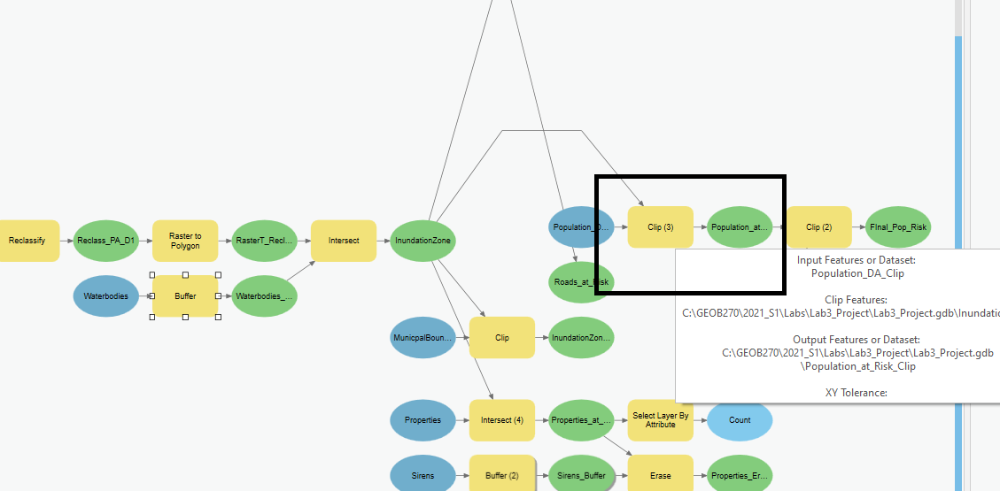
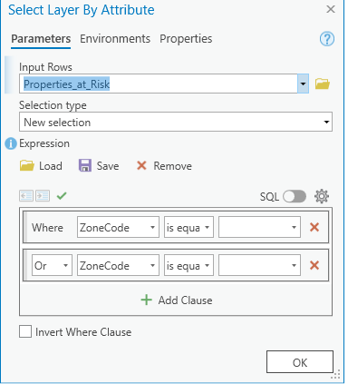

# Geospatial Analysis

## Automating our Analysis with Model Builder
We’re going to use a tool called Model Builder to organize and save all of our analysis steps in one place.  When we use model builder, if any of our inputs or parameters change, a model can be easily adjusted and rerun at any time.  It also allows us to visualize our analysis process.  This is useful both for editing our own work and sharing it with others.  For a more detailed explanation of Model Builder, check out [this link](https://pro.arcgis.com/en/pro-app/latest/help/analysis/geoprocessing/modelbuilder/modelbuilder-quick-tour.htm).

<iframe width="560" height="315" src="https://www.youtube.com/embed/EieOCReT640" title="YouTube video player" frameborder="0" allow="accelerometer; autoplay; clipboard-write; encrypted-media; gyroscope; picture-in-picture" allowfullscreen></iframe>
 
We will add all the necessary layers to your Map, and open the model.  Note the layer names listed here may differ from yours depending on your you named them.
    PA_Roads
    Sirens
    Properties
    Population_DA_Clip
    Waterbodies
    PA_DEM_Clip

## Question 6)
Why are we using model builder for this analysis?

## Identify the Inundation Zone

Our criteria for land areas at risk for flooding are: land at or below 10 m elevation and within 1km of the coastline.

<iframe width="560" height="315" src="https://www.youtube.com/embed/IcK349lACUM" title="YouTube video player" frameborder="0" allow="accelerometer; autoplay; clipboard-write; encrypted-media; gyroscope; picture-in-picture" allowfullscreen></iframe>

In order to identify the land areas in Port Alberni at risk for inundation zone, we need to do four tasks:

Reclassify the PA_DEM to identify all the areas under 10m elevation. See this link for info on the [Reclassify tool](https://pro.arcgis.com/en/pro-app/latest/tool-reference/spatial-analyst/reclassify.htm).
Convert the reclassified DEM to a polygon. See this link for info on the [Raster to Polygon Tool](https://pro.arcgis.com/en/pro-app/latest/tool-reference/conversion/raster-to-polygon.htm).
Buffer the waterbodies by 1km to identify the areas.
Intersect the coastline buffer with the inundation zone. See this link for an explanation of the [Intersect tool](https://pro.arcgis.com/en/pro-app/latest/tool-reference/analysis/intersect.htm).

## Clip the Inundation Zone with the Population_DAs, Properties, and Roads layers

Now that we have the Inundation Zone created, use the clip tool to identify the portions of the Population_DA, Properties, and Roads layers that are that are within the Inundation Zone.  These outputs are important, so we'll give them specific names so we can refer to them later.  Name the outputs Population_at_Risk, Properties_at_Risk, and Roads_at_Risk.

## Question 7)
What is your estimate for the maximum population at risk? *Hint:* Look at the statistics for the Population column in the Population_at_Risk layer.  *Note* the Population column is listed as Value0 in the attribute table.
<!--Me: 15,904 -->
<!--Avinash: 15149 -->
<!--Tin: 12,767 -->

## Question 8)
Why is the result intersecting the Population_DA_Clip within InundationZone most likely an over esitimate?  Hint: Think about what’s going on with the intersect.  Compare the input with the resulting Population_at_Risk layer. 

## Question 9)
What is the difference between the clip tool and the intersect tool?  You can refer to the lecture video on [vector overlay analysis](https://www.youtube.com/watch?v=jkjVX97Xtcc) and compare the outputs from your intersect (InundationZone) with the outputs from the clips (eg. Population_at_Risk).  *Hint* Look at the attribute tables of the input and output layers.

## Buffer the Tsunami Warning Sirens and Erase with At Risk Properties

We need to buffer the Sirens layer by 1000m and the Erase that buffer from the Properties_at_Risk to see if there are any properties that are not adequately served by the tsunami warning sirens.  See the docs for the [erase tool](https://pro.arcgis.com/en/pro-app/latest/tool-reference/analysis/erase.htm)

<iframe width="560" height="315" src="https://www.youtube.com/embed/af2Re9qoVCg" title="YouTube video player" frameborder="0" allow="accelerometer; autoplay; clipboard-write; encrypted-media; gyroscope; picture-in-picture" allowfullscreen></iframe>

## Select the Residential Properties at Risk

Use the ZoningCode.csv file you were given to label identify the zone code for residential and multi-family residential.  Add a select by attribute to your model, to identify the residential properties at risk.  *Hint* Make sure to select for both residential types (Multi family/Single family) using the OR operator.

## Question 10)
Why are we using the OR operator if we want both multi AND single family residential properties?

## Question 11)
How many residential properties are at risk of Inundation?
<!--Me: 699 -->
<!--Tin: 696  -->
<!--Avinash: 673 (zone 2) -->